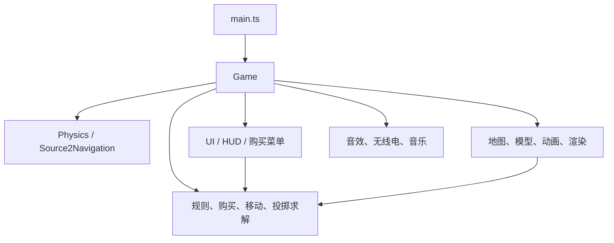

# 项目架构与扩展性评估

复核日期：2026-09-26。范围：当前源码、资源脚本、测试、构建、CI 和文档。项目现在**只保留原始 CS2 素材模式**。

## 结论

当前目录清楚、依赖较少，适合维护本地 Dust II 演练。旧生成地图和两种模式的兼容逻辑已经移除，无需为多种资源模式保留抽象。主要维护成本仍集中在 `Game`：它同时管理比赛、AI、战斗、装备、输入与呈现。

这次优先删除实际冗余，没有为未来假设的功能增加框架。若继续扩充玩法，优先把战斗结算与比赛推进从 `Game` 提取出来。

## 当前结构

| 位置 | 职责与阅读入口 |
| --- | --- |
| `src/main.ts` | 创建唯一游戏实例，处理启动失败 |
| `src/game/game.ts` | 启动、比赛循环和各模块协调 |
| `src/game/` 其余模块 | 规则、购买、移动、武器手感、投掷求解、Rapier 物理、Source 2 导航与音频 |
| `src/world/` | 地图/模型加载、角色动画、渲染、预热和特效 |
| `src/ui/` | DOM 界面、HUD、购买菜单和设置 |
| `scripts/` | 本机原始资源导出/转换、资源完整性和架构盘点 |
| `tests/` | 规则、物理、动画、声音和关键缺陷的行为回归 |
| `docs/` | 使用、架构、素材和验证文档；[完整入口](../README.md) |
| `public/assets/source2/` | 本机运行素材，被 Git 忽略 |
| `local-assets/`、`.local-tools/` | 原始输入、中间产物与转换工具，被 Git 忽略 |

这是职责示意。具体文件图没有循环，但目录不是严格的单向分层，例如原始模型加载器仍会读取或更新装备规则表。启动顺序为：地图 → 物理/导航 → 装备/角色/声音 → 场景 → 预热 → 游戏循环。比赛模拟固定 60 Hz，绘制由 `RenderBudget` 限制，音乐另有调度。

## 本次简化

| 项目 | 调整 |
| --- | --- |
| 地图与导航 | 删除生成地图、Recast 包装和导航生成脚本；直接使用 `Source2Navigation`，不再重复创建地图模块内的导航实例 |
| 模型与渲染 | 删除生成角色、枪械、C4、投掷物、材质及 SSAO 分支；原始模型未加载时明确报错 |
| 声音与 HUD | 删除生成模式的合成枪声/脚步回退和占位图标，保留项目的界面提示音 |
| 构建 | 移除 `VITE_MAP`、资源模式复制器和重复导航生成；Vite 正常复制 public，构建前检查原始资源 |
| 依赖与素材 | 移除两个 Recast 直接依赖及其 WASM 包、21 张 CC0 纹理、旧导航文件和来源表 |
| CI | 用源码检查工作流替换 GitHub Pages 发布；本机原始素材不交给公共 CI 构建或发布 |
| 开发验收 | 移除嵌在 `Game` 内的大型 QA 面板、强制状态修改和压测模式，仅保留只读快照与性能诊断 |

清理前后：源码模块 **60 → 57**；`Game` **138,425 → 97,841 字节**，其中开发验收代码 **36,492 → 2,764 字节**。主生产 JavaScript 约 **3.95 → 3.82 MB**，同时移除了约 726 KB 的 Recast 分块。当前检查结果见 [VALIDATION.md](VALIDATION.md)。

## 测试精简依据

测试从 **131 项 / 25 文件** 精简为 **108 项 / 23 文件**。删除范围如下：

- 生成地图的导航与碰撞测试，以及两种资源模式切换/复制测试。
- 与 `check:assets` 重复的武器、投掷物、音乐文件存在性清单。
- 原始数据固定数量、版本号、网格/动画数量等快照式断言。
- 重复的急停测试、只读取准备时间常量的测试，以及持雷循环中重复执行的同一断言。

保留比赛胜负、经济/退款、弹药守恒、最近目标/友伤、接管、角色碰撞、真实骨骼命中、贴花修正、地面对齐、烟火遮挡、音频回收和暂停停绘等行为。资源检查负责文件引用完整性，测试负责行为，浏览器负责场景和交互检查。

表面适配测试改为调用公开函数，不再拼装 `Source2Level` 的私有状态。少数 `Game` 集成回归仍需 `Object.create(Game.prototype)`；这些测试覆盖真实缺陷，不能仅因夹具复杂就删除。后续提取业务模块时再缩小它们的依赖。

## 值得保留的设计

- `BuySession` 集中管理购买凭据、退款资格和重购计划。
- `GrenadeCollision` 提供小接口，实战与训练轨迹共用飞行求解。
- `rules`、`movement`、`weapon-handling`、`presentation` 可脱离浏览器测试。
- `SpatialAudioBank` 集中处理共享解码、声部上限和回收。
- 绘制预算、世界分辨率、角色可见性与静态阴影分别由明确模块承担。

`pickups.ts`、`teamplay.ts` 等短文件有独立规则价值，不必按行数合并。当前规模也不需要 ECS、全局事件总线或新的状态管理框架。

## 后续改进优先级

1. **集中战斗与比赛状态。** `Game` 仍有 78 个方法、39 个本地运行模块导入。先提取 `shoot / damage` 的结算，再提取比赛计时和炸弹状态推进；接受所需状态与查询，返回结果，由协调器处理画面和声音。避免把整个 `Game` 传给新文件。
2. **明确资源所有权。** `useSource2Map()`、`WEAPONS` 和模型工厂仍是共享可变状态。单实例使用可行；若需要加载失败重试或反复挂载，应由加载器返回资源目录/工厂，并建立完整释放入口。当前事件监听、interval、音频、物理和 GPU 资源尚未形成统一卸载流程。
3. **集中装备和地图知识。** 新增武器仍需同时修改类型、装备表、导出配置、购买栏位及 AI 偏好；地图路线也写在 `botRoute()`。出现对应扩展需求时集中这些配置，保留特殊射击行为的明确实现。
4. **提高资源重建可复现性。** 转换依赖本机工具、VPK、声音定义和 AO 输入。先明确阶段输入/输出、工具版本和关键 JSON 字段校验，暂不增加通用流水线框架。
5. **改善可读性。** 修改相关模块时展开压缩的控制流，避免同一行混杂状态修改和多个副作用。大型分块的后续拆分应依据加载/解析测量决定。

`check:architecture` 是只读盘点工具，尚未对结构发现设置失败退出码。CI 运行类型检查与可执行测试；缺少本机原始资源时，相关集成测试会跳过，不能代替本机验收。

## 文档整理

[README.md](../README.md) 负责启动和阅读导航；[VALIDATION.md](VALIDATION.md) 负责当前检查结果；[ASSETS.md](../ASSETS.md) 负责来源和许可；`LOCAL_*.md` 保留领域转换步骤及适配限制。

场景修正并入 [LOCAL_CS2.md](LOCAL_CS2.md)，删除重复的 `SCENE_AUDIT.md`；投掷物研究保留原始证据，删除已落地的实现建议。旧测试总数、过往清理日志、重复性能采样及生成地图说明已清理。
